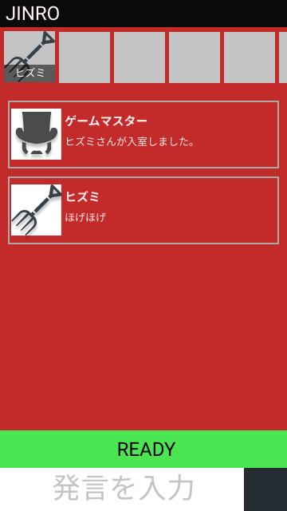

# Jinroゲームクライアント

## レイアウト

## 機能一覧

- スキル発動対象プレイヤーの選択
- JinroAPIの呼び出し
- 受信した情報の画面の反映
  - 入退出時のプレイヤーの追加・削除
  - メッセージの送受信
  - メッセージの表示
  - 限定公開メッセージの送受信
  - 限定公開メッセージの表示
  - 役職アイコンの表示
- チャットのオンオフ
- 各役職のスキル
  - 人狼
  - 占い師
  - 狩人
  - 霊媒師
- 追放投票
  - 同表の場合

## 通信方法

API呼出：Ajax
情報の受信：Server-Sent Events

## 要件

### クライアント全体

- 各プレイヤーが文字ベースのコミュニケーションが取れる
- 全員がStanbyからReady状態に移行したら、ゲームスタートができる。
- 追放されたプレイヤーや途中入室のユーザーは、見る以外できない
- 今が朝、夕方、夜のどの状態か表示する
- 今が夕方の場合だけ、投票するボタンを押せるようにする
- 役職ありのプレイヤーの画面だけ、アイコンを村人から変える
- 他のプレイヤーが入室したら、通知する
- 夜だけ、能力を使うボタンが表示される。
- 人狼の人だけでコミュニケーションが取れる方法を作る。
- 役職のアビリティは、人狼より先に発動する。
- 誰でもゲームスタートができる。

### 役職別

#### 人狼

#### 占い師

#### 狩人

#### 霊媒師
