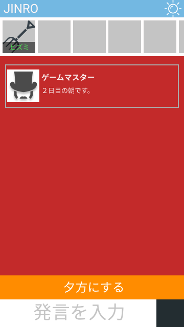
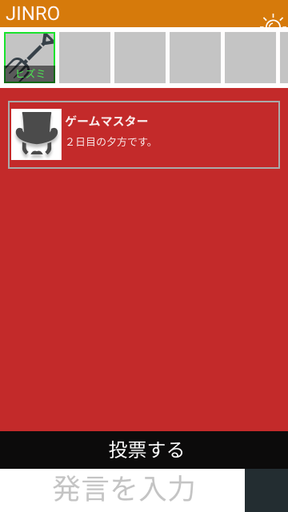
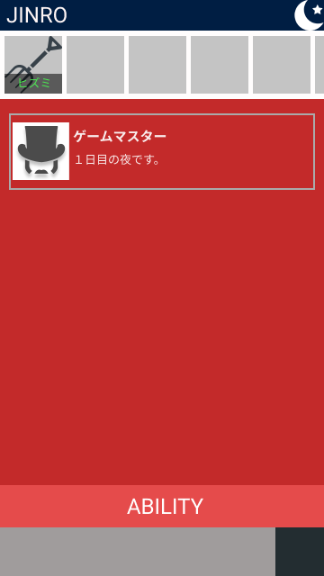

# Jinroゲームクライアント

## レイアウト

## フレームワーク

- Vue.js(Node.js)

## 機能一覧

- スキル発動対象プレイヤーの選択
- JinroAPIの呼び出し
- 受信した情報の画面の反映
  - 入退出時のプレイヤーの追加・削除
  - メッセージの送受信
  - メッセージの表示
  - 限定公開メッセージの送受信
  - 限定公開メッセージの表示
  - 役職アイコンの表示
- チャットのオンオフ
- 各役職のスキル
  - 人狼
  - 占い師
  - 狩人
  - 霊媒師
- 追放投票
  - 同表の場合
- 受信失敗した場合
- 昼の状況

## 通信方法

API呼出：Ajax  
情報の受信：Server-Sent Events  
受信したデータは、expelであれば、playerコンポーネントのexpelのフラグを立てるなど。

## 基本動作

- サーバーから送られてくるデータのEventを見て、必要であれば、オブジェクトを操作して、不要ならば破棄する。
- 他、昼→夕方→夜の時間帯サイクルを回す。
  - 時間帯の動作仕様は、下記参照

### Event別挙動

#### Enter

#### Ready

#### start

#### restart

#### nextDay

roomのdayをインクリメントする。

#### quit

#### end

#### vote

#### expel

#### attack

#### open

#### mystic

#### guard

---

2019年7月追加

#### Standby

#### message

#### jinromessage

#### NextTime

## 時間帯

### 共通

昼から夕方、夕方から夜。
時間帯を移動するときは、JinroAPIのNextTimeを呼び出す。
夜から昼に、移動するときは、NextDayを呼び出す。

### 昼

- 終了条件：10分またはアクションボタンが押される。
- プレイヤー全員で議論する時間とする。
- アクションボタンの機能は、"夕方にする。"
  - 議論する余地もなくなった場合など、10分もいらないケースに利用する。

画面レイアウト

### 夕方

- 終了条件：全員が投票する。
- 議論の結果、追い出す人を決める時間。
- アクションボタンの機能は、"投票する"
  - プレイヤーを選んで投票する。
  - 選ぶとそのプレイヤーのアイコンが緑色に縁取りされる。

画面レイアウト

### 夜

- 終了条件：人狼と役職持ちの行動が終了する。
- 村人と狂人は、チャットが送信できない。
- 人狼はチャットが送信できるが、人狼専用になり、他の人は見ることができない。
- アクションボタンの機能は、"能力を使用する。"
  - プレイヤーを一人選んで、能力を使用できる。
  - プレイヤーを選択せずに、ボタンを押した場合は使用せずに、夜の行動を終了する。
  - 人狼は、誰か能力を使った段階で、夜の行動を終了する。
  - 夜の行動を終了したら、アクションボタンは押せなくなる。

画面レイアウト

### ゲームの局面で呼び出すAPI

| パターン       | 呼び出すJinroAPI | 引数                    |
| ---------- | ------------ | --------------------- |
| 夕方にする      | NextTime     | 無し                    |
| 投票する       | vote         | プレイヤーの名前(Player.name) |
| 追い出す       | expel        | プレイヤーの名前(Player.name) |
| 能力を使う（人狼）  | attack       | プレイヤーの名前(Player.name) |
| 能力を使う（霊媒師） | mystic       | プレイヤーの名前(Player.name) |
| 能力を使う（占い師） | overlook        | プレイヤーの名前(Player.name) |

#### スキル発動プレイヤーの選択

選択不可能なプレイヤーの背景を灰色にして、選択不可能を示す。

### コンポーネント

- gameClient.vue
  - 子コンポーネント
    - title.vue
    - playerWindow.vue
    - chat.vue
  - 子オブジェクト
- playerwindow.vue
  - 子コンポーネント
    - player.vue
  - プロパティ
    - mode:boolean
    - Players:Array(Player)
  - AddMember(Player)
  - RemoveMember(Player)
- chat.vue
  - 子コンポーネント
    - toolbar.vue
    - message.vue
  - プロパティ
    - messages:Array(message)
    - sendUrl
  - メソッド
    - AddMessage(Message)
- player.vue
  - プロパティー
    - name
    - job
    - status

### その他オブジェクト

- room
  - Name:String
  - isPlaying:boolean
  - Status:int（0：昼、1：夕方、2：夜）

### クライアントで保持する情報

- 名前
- 職業
- 各プレイヤーの状況
- 部屋の情報
- 日にち

## 要件

### クライアント全体

- 各プレイヤーが文字ベースのコミュニケーションが取れる
- 全員がStanbyからReady状態に移行したら、ゲームスタートができる。
- 追放されたプレイヤーや途中入室のユーザーは、見る以外できない
- 今が朝、夕方、夜のどの状態か表示する
- 今が夕方の場合だけ、投票するボタンを押せるようにする
- 役職ありのプレイヤーの画面だけ、アイコンを村人から変える
- 他のプレイヤーが入室したら、通知する
- 夜だけ、能力を使うボタンが表示される。
- 人狼の人だけでコミュニケーションが取れる方法を作る。
- 役職のアビリティは、人狼より先に発動する。
- 誰でもゲームスタートができる。

### 役職別

#### 人狼

#### 占い師

#### 狩人

#### 霊媒師

### 補足

- アクションボタンは、必ず、確認ダイアログを表示する。

